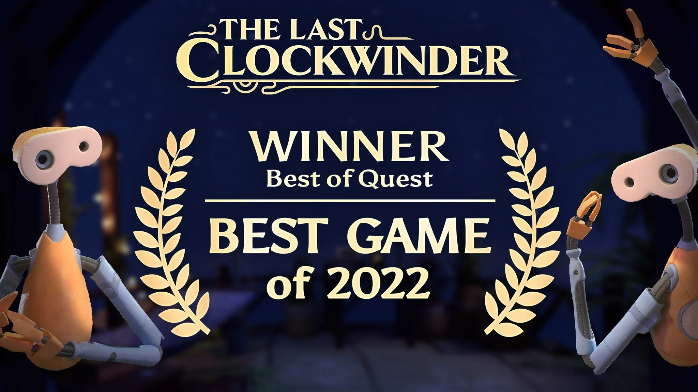
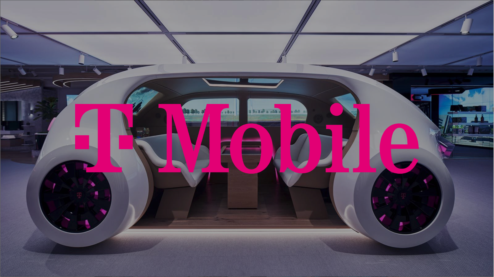
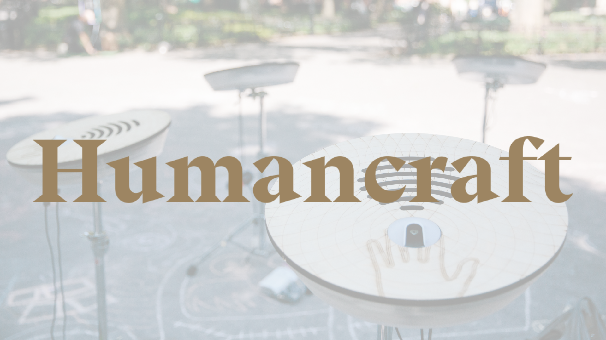
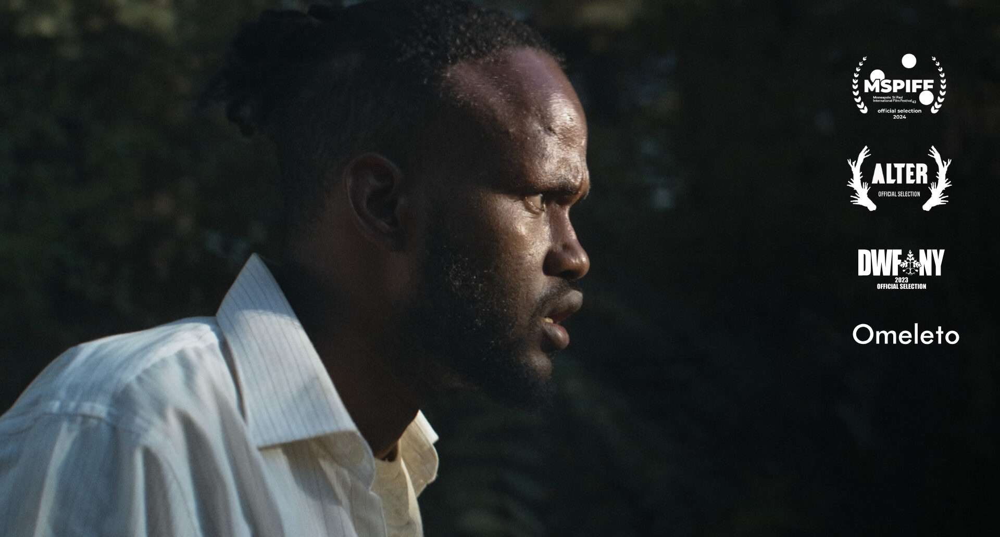
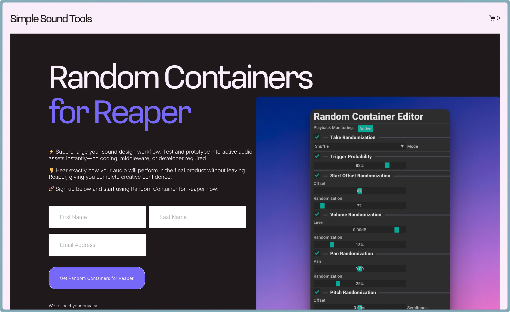

designs, creates, and enables sounds

## Recent Projects

### [[Portfolio/The-Last-Clockwinder|The Last Clockwinder]]
**Sound Designer**
Collaboration with Joel Corelitz on Pontoco's award-winning VR puzzle game

---

### [[Portfolio/T-Mobile-5Gme|T-Mobile: 5G&me Experience Center]]
**Sound/Music Designer**
4,000-square-foot immersive exhibition at T-Mobile US headquarters

---

### [[Portfolio/Beam-Suntory|Beam Suntory]]
**Sound/Music Designer**
Interactive installation at Beam Suntory's US headquarters

---

### [[Portfolio/Alex|Alex]]
**Sound/Music Designer**
Audio and music for Jellyvision's employee benefits onboarding system

---

### [[Portfolio/Heartbeat|Heartbeat]]
**Audio/Music Programmer & Designer**
Interactive installation produced by Humancraft

---

### [[Portfolio/Blight|Blight]]
**Composer**
Short film score directed by Markus Hoeckner

---

### [[Portfolio/Simple-Sound-Tools|Simple Sound Tools]]
**Founder**
Platform for custom sound creation tools and workflow software

---

## Case Studies

*With the exception of the voiceover, Daniel designed all the sounds featured in these videos.*

